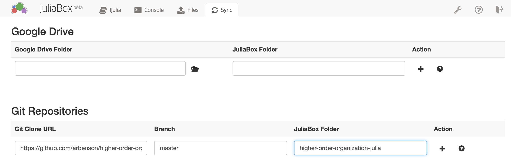
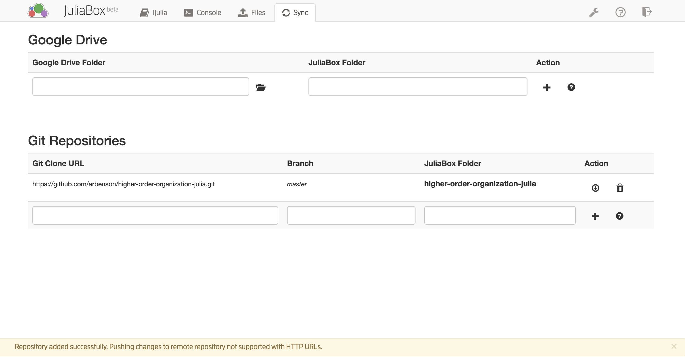
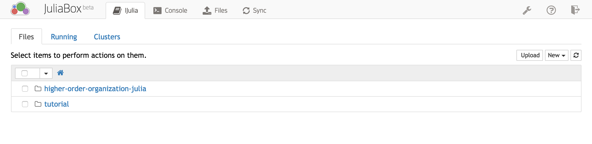

# Run through JuliaBox over the web

These Jupyter notebooks can run Julia code on the web without any installation
of Julia on your computer through [JuliaBox](https://juliabox.org/):

1. Sign in to [JuliaBox](https://juliabox.org/).
2. Selct the `Sync` tab at the top of the page.
3. Under `Git Repositories`, there should be three spaces to fill:
  * Set `Git Clone URL` to `https://github.com/arbenson/higher-order-organization-julia.git`
  * Set `Branch` to `master`
  * Set `JuliaBox Folder` to `higher-order-organization-julia`.
  On completion, it should look like this: 
4. Click the plus sign under `Action`.  This should add the repoistory and look as follows:

5. Click on the `IJulia` tab at the top of the page.  You should have a new folder `higher-order-organization-julia`
 in the home directory: 
6. Click on the folder `higher-order-organization-julia` and then click on one of the files with extension `.ipynb`.

You should now be in an interactive Jupyter notebook.  If you haven't used
Jupyter or IPython before, you may want to read the
[quick start guide](http://jupyter-notebook-beginner-guide.readthedocs.io/en/latest/index.html).
To run all of the code, just click `Cell -> Run All`.
